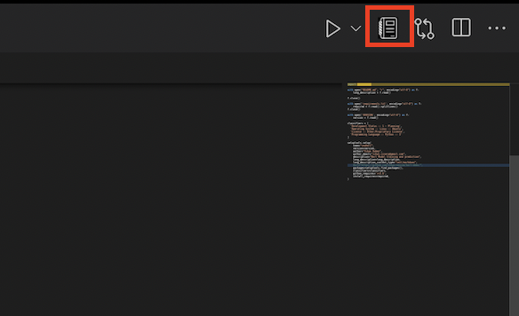
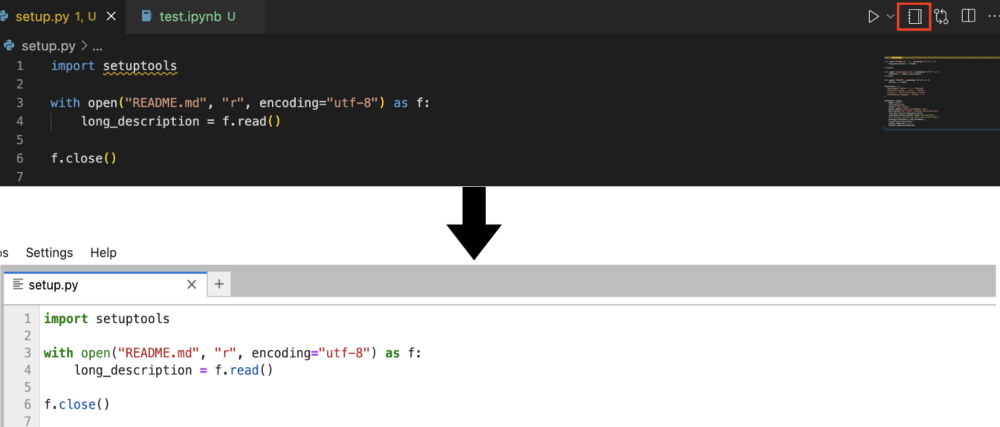
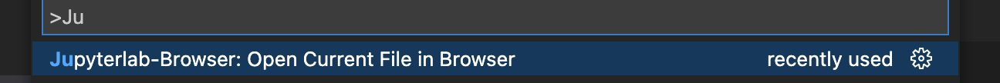
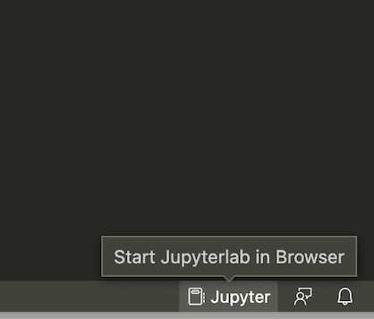
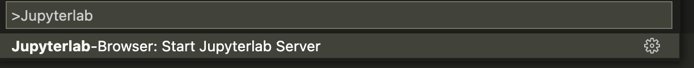

# Jupyterlab-Browser VSCode extension

**Jupyterlab-Browser** is a very simple extension, which allows you to quickly open files in Jupyterlab or start Jupyterlab session in a browser with a single click in VSCode. 

## Features

### Opening any notebook/script in jupyterlab:

* You can find a `notebook` icon on the top right corner of any notebook or file. Click to open in it in jupyterlab, as show below:

    

> **Opening any notebook/script in jupyterlab**:

    

* Alternatively, you can find `Jupyterlab Browser: Open Current File In Jupyter` by pressing `CMD/CTRL + SHIFT + P`

    

### Start Jupyterlab session in Browser:

* You can find an icon to open **Jupyterlab-Browser** on the bottom-right corner of vscode to start Jupyterlab session (in the status bar), as shown below:

    

* Alternatively, you can find `Jupyterlab Browser:  Start Jupyterlab Server` by pressing `CMD/CTRL + SHIFT + P`

    

## Requirements

Only requirement is to install `jupyterlab` prior to installing the extension.

> `pip install jupyterlab`

## Known Issues

Response time is a bit slow. Takes about 2-3 seconds to work.

## Release Notes

### 0.0.1

* Initial release of `Jupyterlab-Browser` vscode extension.

### 0.0.2

* Readme updates.

### 0.0.3

* Added a functionality to open any notebook/file directly in browser.
* Added a fix to avoid opening multiple jupyter sessions.

### 0.0.4

* updated icons
* added condition for icon to appear only in saved files. 

### 0.0.5

* Updated Readme and the package description.

### 0.0.6

* Changed the default port to 8888 to ensure compaitability with remote machine.

### 0.0.7

* Removing default port to avoid token.

### 0.0.7-0.0.8

* Removing default port to avoid token.

### 0.0.9-0.0.12

* Increase the manual delay to avoid unusual circumstances.

### 0.0.13-0.0.14

* Updated existing apporoach for opening directly to jupyter-lab. Removed delay idea.

### 0.0.15

* Added capability of relative path detection.

### 0.0.16-0.0.21

* Small icon improvements.
-----------------------------------------------------------------------------------------------------------

